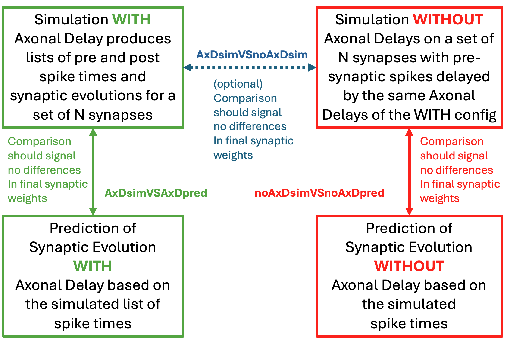

# AxonalDelayTest

Testbed to evaluate **axonal** and **dendritic** delays in NEST, and to verify that a two-delay implementation (axonal + dendritic delay, in the following **AxD**) behaves as expected relative to current released NEST versions (dendritic-only “synaptic delay” in the following "single delay" **noAxD**).  
It runs controlled simulations, logs spikes and weight trajectories, computes **offline STDP predictions**, and compares **simulation vs prediction** for both the **AxD** and **NoAxD** configurations, as well as (optionally, dotted in the next figure) the equivalence of the synaptic trajectory of **AxD** vs **noAxD** simulations.

> Authors: Pier Stanislao Paolucci, Elena Pastorelli  
> License: GPL-3.0-only


---

## What’s in the repo

```
AxonalDelayTest/
├─ config_sim_test_Ax_and_Dendr_Delay_STDP.yaml   # USER: Please change this file
├─ main.py                                   # Orchestrates the full pipeline
├─ sim_stdp_alpha_forced_pl_lib.py           # NEST simulation (forced spikes, STDP, logging, plots)
├─ predict_stdp_alpha_forced_pl_lib.py       # Offline STDP predictor + plots, using spike time from sims
├─ compare_sim_prediction_lib.py             # CSV comparators with relative-threshold checking
├─ add_rand_events_lib.py                    # Adds reproducible random pre/post spikes per synapse
├─ read_config_lib.py                        # Loads/validates YAML config, fills sane defaults
├─ utils_lib.py                              # Output folder bundling, failure config dumper, misc
├─ config_deterministic.yaml                 # Deterministic, concise test-case config, included in addition to rand tests
└─ README.md / LICENSE
```

---

## Key idea & flow

1) **Simulation (NEST)**  
   - A population of N **pre** and **post** neuron pairs are connected by a single synapse per pair. Each pair is driven by external **spike_generators** that stimulate both the pre- and post- neurons. They enforce precise pre-synaptic spike trains, while the exact timing of post-synaptic spikes is affected also by the currents injected by the connecting synapse. The set of neuron pairs may include both pairs driven by **determinist** lists of events and **randomly** driven pairs.  
   - Synapses implement a **pair-based, homogeneous STDP** rule (see `stdp_params`).
   - Two modes are run:
     - **AxD**: uses **axonal_delay_ms** + **dendritic_delay_ms** as provided. This simulation uses the "stdp_pl_synapse_hom_ax_delay" synapse model.
     - **noAxD**: delays the presynaptic stimuli by an amount equal to the an **axonal** delay specified by either the config file **AxD** or additional **random** pairs for the **AxD** simulation, while the simple "delay" is set equal to the dendritic delay. This sim uses the "stdp_pl_synapse_hom"` (fallback; standard dendritic delay only).
   - Spikes, membrane traces (optional), and **weight evolution** are logged and plotted.

2) **Prediction (offline)**  
   - Loads the pre/post spike CSVs emitted by the simulation.
   - Applies the formulas of the **STDP rule** to produce a predicted weight trajectory and summary.
   - Produces rasters & weight plots of the **predicted** synaptic evolution.

3) **Comparison**  
   - `compare_sim_prediction_lib.py`:the final value assumed by the synapses of **simulation vs prediction** (AxD and noAxD) with a relative difference threshold are compared.
   - If the user sets the **compare_AxDsimVSnoAxDsim** config value to: True, the optional test **AxD simulation vs noAxD simulation** is launched (the assumption is the equivalence of the final value of the synaptic trajectory).
   - Failures are summarized and a **minimal reproducer config** is dumped to files: e.g. `AxDsimVSAxDpred_failed_config.yaml` and similar file names for the other comparisons.

4) **Provenance Tracking**
   - Simulation config, outputs and comparison are stored in a `time-stamped` folder 
---

## Requirements

- **Python**: this code has been developed using 3.8
- **NEST Simulator**: official 3.8 and branch https://github.com/JanVogelsang/nest-simulator/tree/stdp_long_axonal_delays for **AxD**

---

## Quick start

```bash
# 1) Adjust the config_.._.yaml if needed (see next section).
# 2) Run the full pipeline:
python main.py
```
If `save_files_in_folder: true`, all outputs are copied to a timestamped folder.

**\<prefix\>**:
In this readme <prefix> can assume two values:
<prefix> = `AxD` for sim/pred with Axonal Delay
<prefix> = `noAxD` for sim/pred without Axonal Delay

What you’ll get (filenames are prefixed with `AxD` or `noAxD` for the two modes):
- **Simulation**:
  - `<prefix>_sim_summary.csv` (per-synapse simulated start/final weights)
  - `<prefix>_spikes_pre_neurons.csv`, `<prefix>_spikes_post_neurons.csv` (spike times from sim)
  - `<prefix>_simulated_synaptic_evolution.csv` (+ `.png`)
  - `<prefix>_simulated_presynneu_raster.png`, `<prefix>_simulated_postsynneu_raster.png`
  - (Optional) membrane traces if `plot_mm: true`
- **Prediction**:
  - `<prefix>_pred_summary.csv` (per-synapse predicted start/final weights)
  - `<prefix>_predicted_synaptic_evolution.csv` (+ `.png`)
  - `<prefix>_predicted_presynneu_raster.png`, `<prefix>_predicted_postsynneu_raster.png`
- Always:
  - `current_config.yaml` (the complete set of deterministic plus random lists of events of the completed run)
  - If AxDsim vs AxDpred **equivalence** mismatch: `AxDsimVSAxDpred_failed_config.yaml`.
  - If noAxDsim vs noAxDpred **equivalence** mismatch: `noAxDsimVSnoAxDpred_failed_config.yaml`.
  - If AxDsim vs noAxDsim **equivalence** mismatch: `AxDsimVSnoAxDsim_failed_config.yaml`.
 
---

## Configuration (YAML)

Both example configs are self-documenting. Here are the important fields they support (actual defaults are set in `read_config_lib.py`):

**Network size & selection**
-  `described_syn `: total number of synaptic events manually specified in this file (can be set to zero)
-  `add_rand_syn `: total number of synaptic events automatically added using a random generation algorthm (can be set to zero)
- `random_seed`: seed for any randomized additions.
- `max_rand_events_per_syn`: cap random events per added synapse.
-  **NOTE**: The total number of synapses `N` is the sum of described_syn and add_rand_syn

Optionally restrict processing with:
  - `start_syn`, `end_syn`: inclusive indices of the synapse subset to plot, if you want to focus your attention.

**Delays (per-synapse lists, length `described_syn`)**
- `axonal_delay_ms`: axonal component for synaptic events manually specified.
- `dendritic_delay_ms`: dendritic component for synaptic events manually specified.
- `min_axonal_delay_ms` / `max_axonal_delay_ms` and `min_dendritic_delay_ms` / `max_dendritic_delay_ms` must be set to drive the range of delays for events automatically added using a random generation algorthm.

**Initial Weights (per-synapse lists, length `described_syn`)**
- `W_init`: initial synaptic weight for synaptic events manually specified.   
- `W_min`, `W_max` must be set to drive the range of inital synaptic values for for events automatically added using a random generation algorthm.

**Spike trains (per-synapse lists of times)**
- `spike_train_pre_ms`: list of lists (one list of times per pre-neuron/synapse) for synaptic events manually specified.
- `spike_train_post_ms`: same for post neurons.  
  You can start with empty lists and let `add_rand_syn` add more synapses.  
  `add_rand_events_lib.py` ensures:
  - a guard **window** so the last enforced pre-spike occurs before the simulation end,
  - unique times to 0.1 ms resolution,
  - reproducibility via `random_seed`.
 
**Timing & resolution**
- `T_sim_ms`: total simulated time (ms).
- `save_int_ms`: cadence for saving weight evolution.
- `resolution`: NEST simulation resolution (ms).

**Run control**
- `verbose_sim`, `verbose_pred`: verbose prints.
- `plot_display`: show figures at the end (set `false` in headless/HPC).
- `sim_plot_save`, `prediction_plot_save`: write out `.png` plots.
- `save_files_in_folder`: copy all declared outputs into a timestamped dir.

- `compare_AxDsimVSnoAxDsim`: also compare AxD vs noAxD simulation summaries.

**I/O**
- `<prefix>_csv_file_pre`, `<prefix>_csv_file_post`: names for pre/post spike CSVs **emitted by the simulator** and **consumed by the predictor** (they’re automatically prefixed per mode).

**Neuron & forcing**
- `neu_params`: passed to `iaf_psc_alpha` (defaults provided).  
  Example (from the configs):
  ```yaml
  neu_params:
    C_m: 250.0
    E_L: -70.0
    t_ref: 2.0
    tau_m: 10
    V_th: -10.0
    V_reset: -70.0
  ```
  A high `V_th` can be used to avoid additional spikes (i.e. not caused by the external stimuli); spikes are **forced** via generators.
- `forced_in_weight`: weight from spike_generator → pre neuron.
- `forced_out_weight`: weight from spike_generator → post neuron.

**STDP**
- `stdp_params` (homogeneous, pair-based):
  - `tau_plus`, `lambda`, `alpha`, `mu`  
  (Used by both simulation and predictor to keep rules matched.)
   - `w_0`: used in synptic rule in prediction only

---

## Citation / reuse

Please keep the author credits and GPL-3.0-only license.

---
